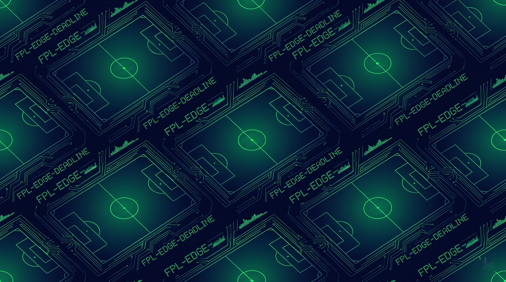
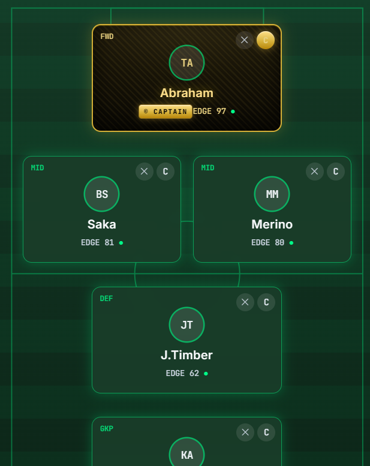
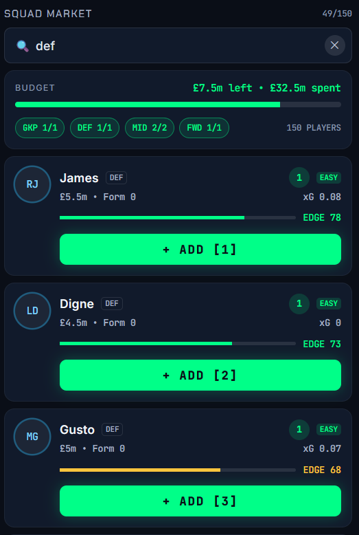

# ⚡ EDGE: Deadline Day

> **FPL-EDGE helped managers decide. Now you beat the algorithm.**
> A 3-gameweek sports analytics strategy game built for the BTT Web Game Jam.



## 🧠 The Concept
Most sports games put you on the pitch. **EDGE** puts you in the front office. 
Inspired by professional analytics dashboards (like FPL-Edge), this game turns raw football data (xG, Fixture Difficulty, Form) into a high-stakes roguelike drafting mechanic. You have a strict budget, a 60-second shot clock, and an AI Assistant that you must learn to trust—or defy.

## Game Shots
***Game Field***


***Player Pool***


## 🏗️ Architecture
The game is 100% client-side, relying on a strict unidirectional data flow. Pure logic lives in `lib/`, state management in `hooks/`, and UI in `components/`.

```mermaid
graph LR
  Data[data/players.ts] --> Engine[lib/simulator.ts]
  Data --> Brain[lib/edgeScoring.ts]
  Config[lib/config.ts] --> Engine
  Config --> Brain
  Engine --> State[hooks/useGame.ts]
  Brain --> State
  State --> UI[components/*]
